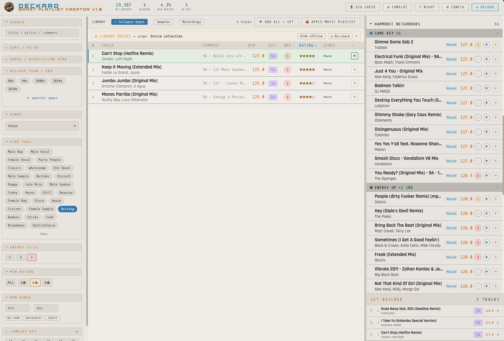
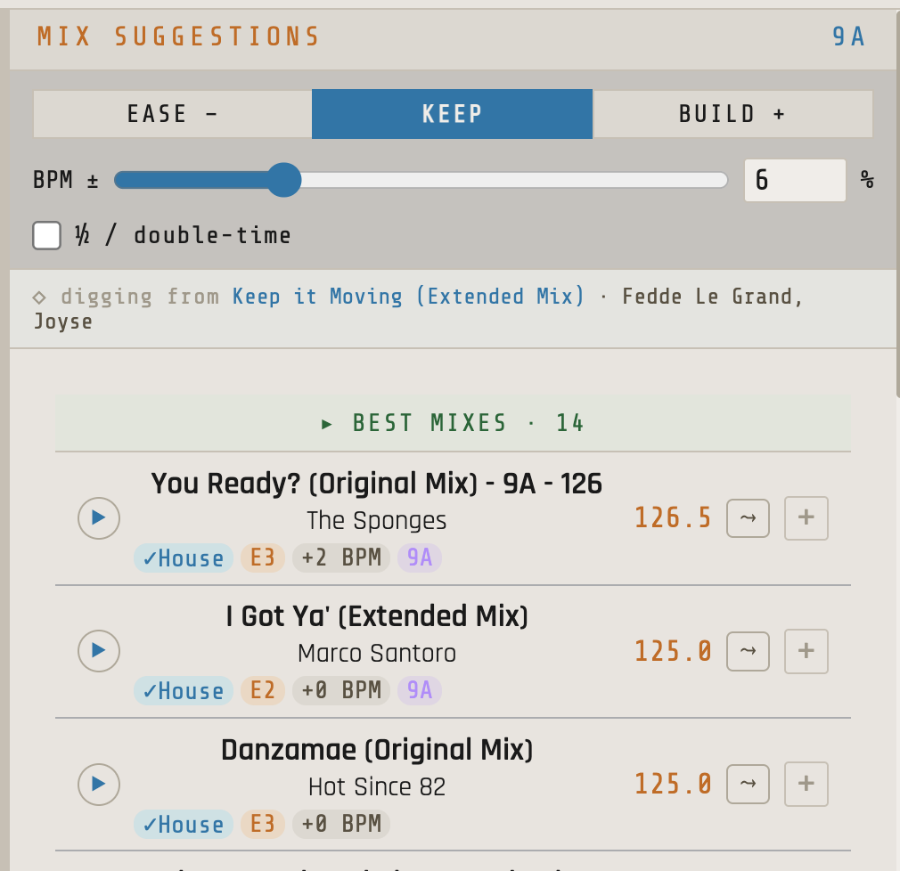
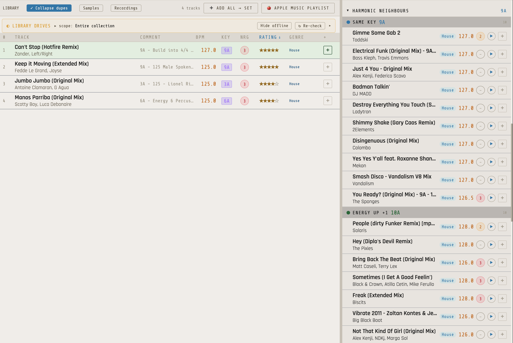
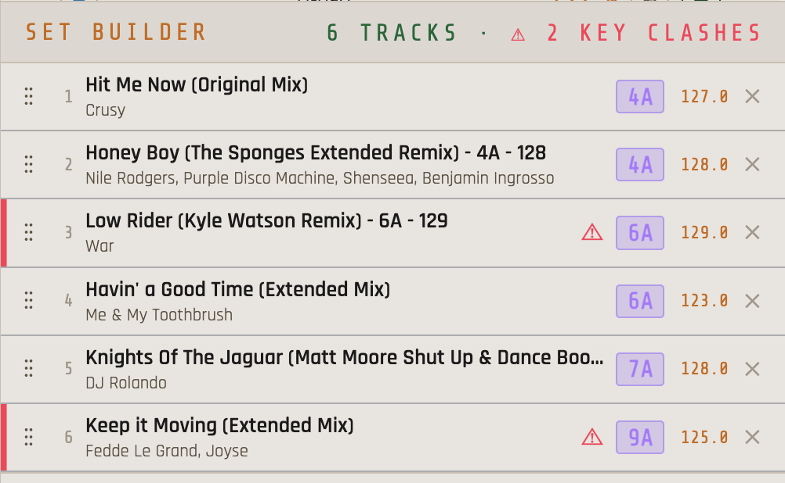
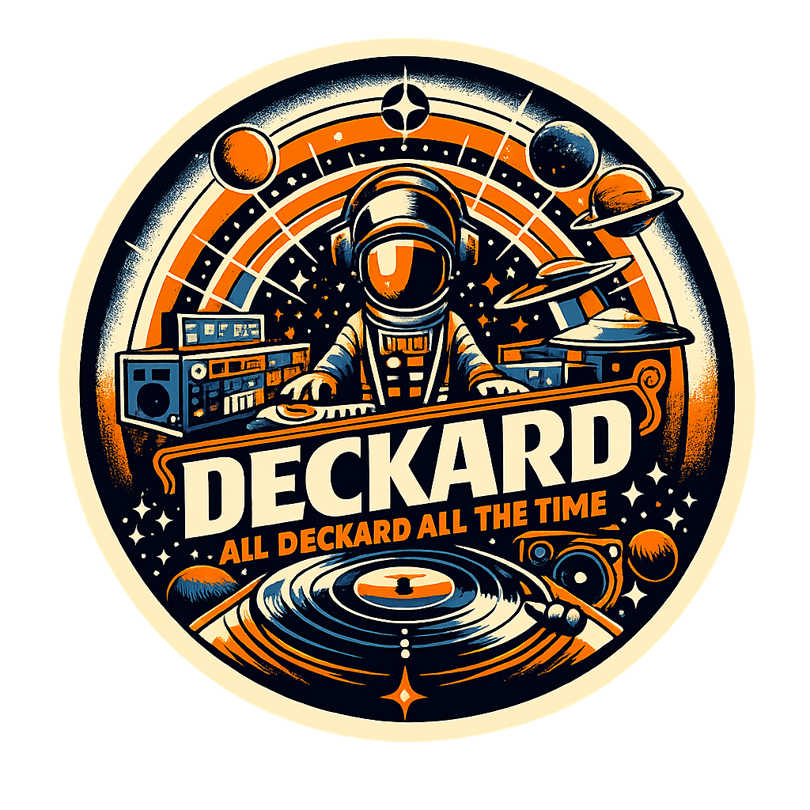

<h1 align="center">Smart Playlist Creator</h1>

<p align="center">
  <b>Build DJ sets the way rekordbox won't let you — then export them straight into rekordbox (or Traktor).</b>
</p>

<p align="center">
  <i>Local-first · free · open source · nothing in the cloud</i>
</p>

---

## Why this exists

rekordbox is built for **performing**, not for **building sets**. The filtering is
thin, there's no "what actually mixes with this," and digging a set out of a big
library is slow and manual. If you keep an organized library but dread *assembling
playlists* in rekordbox, this does that part better — and hands the finished
playlist back to rekordbox when you're done.

It runs on your machine and reads the library you already have. No re-tagging, no
migration, no account, nothing uploaded.



## What it does

- **"What plays next"** — pick a track and it ranks candidates by **key (harmonic) → BPM → genre**, with an Ease / Keep / Build intent toggle and an adjustable BPM window (plus ½-/double-time).
- **Fast crate digging** — filter your library by genre, BPM, key, rating, year/era, and **vibe tags mined from your own comments**. Multi-condition, instant.
- **Set builder + exports** — build a set and send it out three ways:
  - **rekordbox XML** (the safe, universal import file)
  - **Direct rekordbox DB write** (no import step — backs up your library first)
  - **Traktor NML**
- **In-app preview** — hover any track to play it; scrub from a player bar.
- **Rate once, everywhere** — click stars and the rating is written into the file's tag, so it shows up in both Traktor and rekordbox.
- **USB pre-flight** — before you leave for a gig, verify a stick actually carries a real, fresh rekordbox export (catches the classic "looks fine in the UI but was never *Export to Device*-d" failure).
- **Camelot ↔ Western** key notation toggle.





## Who it's for

- DJs with an organized **Traktor** or **rekordbox** library who find rekordbox's
  playlist-building slow or limited.
- People who want a fast, private, local set-builder — not a cloud service.

**Not** for: cloud-only / streaming libraries (it works on files that are actually
on disk), or Windows yet (macOS today — Windows is on the roadmap).

## Requirements

- **macOS**
- A library source — **either** a **Traktor** collection (`collection.nml`) + **Mixed In Key** "All Playlists" JSON, **or** a **rekordbox** library (`master.db`)
- **rekordbox** if you want to export to it
- Python 3

## Install & run

```bash
git clone https://github.com/kah1970/smart-playlist-creator.git
cd smart-playlist-creator
pip3 install -r requirements.txt     # or just run ./launch.sh (auto-installs Flask)
cp config.example.json config.json   # then set your paths (or use the in-app config screen)
./launch.sh                          # opens http://localhost:5001 (set SPC_PORT to change)
```

On first run the app opens a config screen with **Browse…** buttons — point it at your
Traktor `.nml` and Mixed In Key JSON (paths are never hardcoded). If your source is
**rekordbox**, install `pyrekordbox` (it reads your `master.db` and powers the direct
`→ RB` write). `mutagen` is optional — only for writing star ratings back into files.

→ New here? See **[QUICKSTART.md](QUICKSTART.md)** (install to first export in ~5 min).

## Getting a set into rekordbox

- **XML (safe default):** rekordbox → Preferences → Advanced → Database → *rekordbox xml* → point it at the exported file, then drag the playlist in from the "rekordbox xml" tree.
- **Direct (→ RB):** quit rekordbox first; the app backs up `master.db`, then writes the playlist straight into your library.



## Energy tiers (optional)

You can prefix a genre with an energy number so **one tag sorts by both energy and
genre** (Traktor and rekordbox can't multi-sort, so you pack both into the genre
field):

```
1 - Deep House     → energy 1 (warm-up / lower)
2 - House          → energy 2 (building / mid)
3 - Tech House     → energy 3 (peak / high)
```

The app splits the leading number off as an energy tier and treats the rest as the
genre. **Don't want it?** Just tag plain genres — everything works on genre, BPM, and
key. It's purely optional.

## Vibe tags (and how to customize them)

Vibe tags aren't a fixed list — they're read **live from your track comments**.
Comma-separate descriptors in the comment field and they become filters:

```
Comment:  Party People, Bouncey, Male Vocal
```

To **add, change, or remove** a vibe tag, edit the comments on your tracks (in
Traktor/rekordbox) and reload. Two optional knobs in `config.json`:

- **`vibe_tag_min_count`** (default `8`) — a tag must appear on at least this many
  tracks to show. **Lower it for a smaller library** (e.g. `3`), or you'll see few tags.
- **`vibe_tag_exclude`** — a list of terms you never want as tags, e.g.
  `["promo", "my label"]`.

## USB pre-flight (gig safety check)

```bash
python3 usb_preflight.py --usb /Volumes/YOUR_STICK_NAME
```

Exit code `0` = pass, `1` = hard fail, `2` = stick not mounted, `3` = warnings (e.g.
the export looks stale) — safe to chain, e.g. `… && eject`.

## Notes & caveats (kept honest)

- **Local files only** — preview/export work on files actually on disk; cloud "online-only" placeholders won't play or link until materialized.
- **Direct rekordbox write is unofficial** (via [pyrekordbox](https://github.com/dylanljones/pyrekordbox)) and can break on a rekordbox update — advanced feature, at your own risk, always backs up first. **The XML export is the safe default.**
- **It rewards a tagged library** — the vibe-tag filter needs comments; harmonic suggestions need key data (from Mixed In Key or rekordbox). It still works without them, just with less to go on.

## Project docs

| Doc | For | What's in it |
|---|---|---|
| [QUICKSTART.md](QUICKSTART.md) | new users | 5-minute get-started |
| [MANUAL.html](MANUAL.html) | DJs | the field manual (open in a browser) |
| [DOMAIN.md](DOMAIN.md) | anyone | energy tiers, rating scale, canonical genres, Camelot keys |
| [ARCHITECTURE.md](ARCHITECTURE.md) | contributors | app structure, the re-link layer, REST API |
| [ROADMAP.md](ROADMAP.md) | contributors | status + what's next (known-broken edges kept honest) |
| [CHANGELOG.md](CHANGELOG.md) | anyone | dated history of what shipped |
| [CLAUDE.md](CLAUDE.md) | contributors | how to work on the codebase |

## License

MIT — see [LICENSE](LICENSE). Built by a working DJ, given to the community.
Questions / ideas: **team@djdeckard.com**

---

<p align="center">
  
</p>
